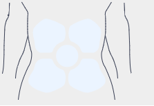
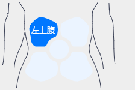

# svg-component-belly

this is a react component for select belly position.

一个选择腹痛位置的react组件，使用svg实现。

## Development

```
npm install
npm run start
```

## Usage

```
import React from 'react';
import BellyPosition from '../src/index';

const Demo = () => (
  <div>
    <BellyPosition onChange={e => console.log(e)} />
  </div>
);

export default Demo;
```

## Screenshot





## License

svg-component-belly is released under the MIT license.
